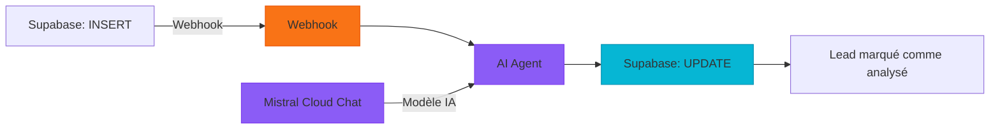

# Workflow : Analyse Automatique des Leads

## 📋 Description

Ce workflow automatise l'analyse financière des nouveaux prospects (leads) en temps réel. **Il est automatiquement déclenché par Supabase** lorsqu'un nouveau lead est inséré dans la table `leads_patrimoine`. Le workflow utilise alors l'IA pour générer une analyse personnalisée et met à jour le lead avec les résultats.

**Cas d'usage** : Pré-qualification automatique des prospects pour le cabinet "Toulouse Invest".

---

## 🚀 Déclencheur

| Type | Méthode | Endpoint |
|------|---------|----------|
| Webhook | POST | `/webhook/[webhook-id]` |

**Mécanisme** : Supabase est configuré pour envoyer une requête POST automatique à ce webhook **lors de chaque insertion** dans la table `leads_patrimoine`. Le workflow n8n écoute sur cet endpoint et traite immédiatement les nouvelles données.

---

## 📊 Flux du Workflow



---

## 🔧 Nodes du Workflow

### 1️⃣ **Webhook**

- **Type** : `n8n-nodes-base.webhook`
- **Rôle** : Point d'entrée du workflow, reçoit les données du lead
- **Configuration** : Méthode HTTP `POST`

**Données d'entrée (exemple)** :
```json
{
  "body": {
    "type": "INSERT",
    "table": "leads_patrimoine",
    "schema": "public",
    "record": {
      "id": "d59bd812-54ab-47ce-b86f-5176e8f2a2df",
      "nom": "Jean Dupont",
      "age": 35,
      "revenus_mensuels": 5000,
      "epargne_liquide": 50000,
      "patrimoine_immobilier": 250000,
      "statut": "en_attente",
      "analyse_ia": null
    }
  }
}
```

---

### 2️⃣ **Mistral Cloud Chat Model**

- **Type** : `@n8n/n8n-nodes-langchain.lmChatMistralCloud`
- **Rôle** : Fournit le modèle de langage IA
- **Modèle** : `mistral-small-latest`

---

### 3️⃣ **AI Agent**

- **Type** : `@n8n/n8n-nodes-langchain.agent`
- **Rôle** : Analyse les données du lead et génère une pré-analyse structurée
- **Modèle connecté** : Mistral Cloud Chat Model

**Personnalité de l'Agent** : Conseiller en gestion de patrimoine expert pour le cabinet **"Toulouse Invest"**.

**Prompt System** :
```
Tu es un conseiller en gestion de patrimoine expert, travaillant pour le cabinet "Toulouse Invest".
Analyse la situation financière de ce prospect et rédige une courte pré-analyse engageante et professionnelle.

INSTRUCTIONS DE FORMATAGE (Obligatoire) :
- Rédige ta réponse en Markdown propre.
- Utilise des titres de niveau 3 (###) pour structurer : "Analyse Rapide", "Points Forts", "Axes d'Amélioration".
- Utilise des listes à puces pour la lisibilité.
- Adopte un ton rassurant et expert.
- Termine par un court paragraphe d'appel à l'action invitant à prendre un premier rendez-vous.
- Ne rajoute aucun commentaire hors du markdown.
```

**Données injectées** :
```
- Nom : {{ $json.body.record.nom }}
- Âge : {{ $json.body.record.age }} ans
- Revenus mensuels : {{ $json.body.record.revenus_mensuels }} €
- Épargne liquide : {{ $json.body.record.epargne_liquide }} €
- Patrimoine immobilier : {{ $json.body.record.patrimoine_immobilier }} €
```

**Sortie** : Analyse IA au format Markdown (champ `output`)

---

### 4️⃣ **Update a row**

- **Type** : `n8n-nodes-base.supabase`
- **Rôle** : Met à jour le lead dans Supabase avec les résultats de l'analyse
- **Opération** : `UPDATE`
- **Table** : `leads_patrimoine`

**Filtre** : `WHERE id = {{ $('Get a row').item.json.id }}`

**Champs mis à jour** :
| Champ | Valeur | Source |
|-------|--------|--------|
| `statut` | `"analyse_terminee"` | Statique |
| `analyse_ia` | `{{ $json.output }}` | Sortie de l'AI Agent |

---

## 🔄 Connexions entre Nodes

```
Webhook → AI Agent
Mistral Cloud Chat Model → AI Agent (comme modèle IA)
AI Agent → Update a row
```

---

## 📝 Exemple de Sortie

**Analyse IA générée** :

```markdown
### Analyse Rapide
Votre situation financière présente un bon équilibre entre épargne liquide et patrimoine immobilier.

### Points Forts
- Revenus mensuels confortables (5 000 €/mois)
- Épargne de précaution solide (50 000 €)
- Patrimoine immobilier significatif (250 000 €)

### Axes d'Amélioration
- Diversifier votre épargne au-delà de l'immobilier
- Explorer des solutions de défiscalisation adaptées à votre tranche marginale d'imposition
- Structurer votre transmission patrimoniale

Nous vous invitons à prendre un premier rendez-vous avec notre cabinet Toulouse Invest pour affiner ensemble une stratégie patrimoniale sur mesure, adaptée à vos objectifs à court, moyen et long terme.
```

---

## ⚙️ Configuration Requise

### Crédentials

1. **Mistral Cloud API** : Clé API Mistral Cloud valide
2. **Supabase API** : URL du projet + clé API (anon ou service role)

---

## 🎯 Schéma de Données

### Entrée (Webhook)

| Champ | Type | Description | Exemple |
|-------|------|-------------|---------|
| `id` | UUID | Identifiant unique du lead | `d59bd812-54ab-47ce-b86f-5176e8f2a2df` |
| `nom` | String | Nom du prospect | `"Jean Dupont"` |
| `age` | Integer | Âge du prospect | `35` |
| `revenus_mensuels` | Integer | Revenus mensuels en € | `5000` |
| `epargne_liquide` | Integer | Épargne disponible en € | `50000` |
| `patrimoine_immobilier` | Integer | Valeur du patrimoine immobilier en € | `250000` |
| `statut` | String | Statut du lead | `"en_attente"` → `"analyse_terminee"` |
| `analyse_ia` | Text | Analyse générée par l'IA | `null` (initial) → Markdown |

---

## 💡 Notes

1. **Insert & Listen Pattern** : Ce workflow implémente le pattern recommandé :
   - Frontend insère les données → déclenche le webhook
   - Workflow traite et met à jour le statut
   - Frontend écoute les changements via Supabase Realtime

2. **Formatage** : L'AI Agent impose un format Markdown strict pour une intégration propre dans l'UI.

3. **Sécurité** : Le webhook doit être sécurisé. Les credentials doivent avoir des permissions minimales.
